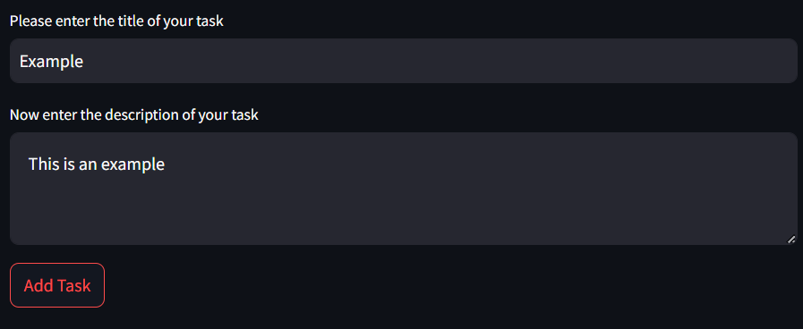
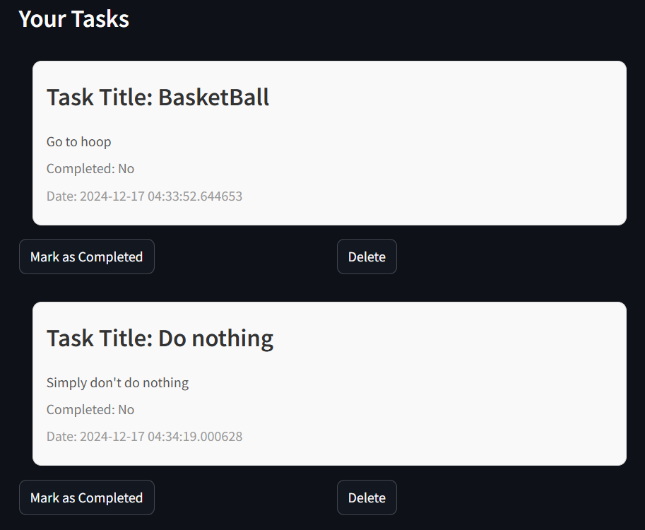
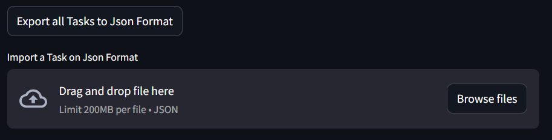

# Task Manager

Esta aplicación te permite **crear**, **leer**, **actualizar** y **eliminar** tareas fácilmente. Además, puedes **importar** y **exportar** tareas en formato JSON.

---

## 🚀 Instalación y Configuración


### 0. Crear un entorno virtual
Recomendamos usar un entorno virtual para aislar las dependencias:

```bash
python -m venv venv
source venv/bin/activate  # En Windows: venv\Scripts\activate
```

### 1. Instalar dependencias
Instala las librerías necesarias desde el archivo `requirements.txt`:

```bash
pip install -r requirements.txt
```

---

## ▶️ Ejecución

Inicia la aplicación con el siguiente comando:

```bash
streamlit run main.py
```

La aplicación se ejecutará en tu navegador en `http://localhost:8501`.

---

## Funcionalidades

1. **Agregar Tareas**: Ingresa el título y la descripción de una tarea.



2. **Listar Tareas**: Visualiza todas las tareas con su información.
3. **Marcar como Completada**: Actualiza el estado de una tarea a "completada".
4. **Eliminar Tareas**: Elimina una tarea de la base de datos.



5. **Importar Tareas**: Carga un archivo JSON con tareas predefinidas.
6. **Exportar Tareas**: Guarda todas tus tareas actuales en un archivo JSON.



---

## Ejemplo de Archivo JSON

Ejemplo de archivo JSON para importar tareas:

```json
[
  {
    "name": "Seguirme en GitHub",
    "description": "Seguir a AndreyJz en GitHub",
    "completed": true,
    "date": "2024-06-01T12:00:00"
  },
  {
    "name": "Estrella",
    "description": "Darle estrella a este repo",
    "completed": true,
    "date": "2024-06-02T08:30:00"
  }
]
```

---

## 👾 Tecnologías Utilizadas

- **Python 3.9+**
- **Streamlit**: Interfaz gráfica interactiva.
- **SQLAlchemy**: ORM para la base de datos.
- **SQLite**: Base de datos ligera y fácil de usar.
- **JSON**: Importación y exportación de tareas.

---

## 🧪 Estructura del Proyecto

```
📂 TaskManager
│
├── main.py               # Archivo principal
├── ui.py                 # Interfaz de Streamlit
├── controller.py         # Controladores para el CRUD
├── Task.py               # Modelo de base de datos
├── configdb.py           # Configuración de la base de datos
├── db.db                 # Base de datos
├── requirements.txt      # Dependencias del proyecto
├── data/                 # Carpeta para archivos JSON
└── assets/               # Imágenes para capturas de pantalla
    └── SonarQube.pdf     # Evidencia del Scanner
```

---

## 📃 Notas

- Para exportar tareas, se guardarán en la carpeta `data/` como `tasks.json`.
- El archivo JSON para importar tareas debe cumplir con el formato mostrado en el ejemplo.

---
